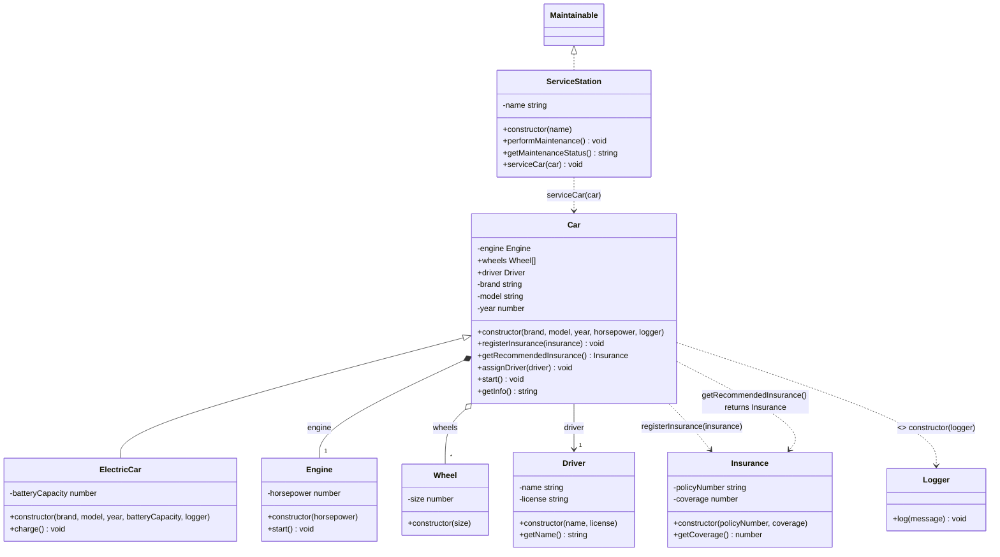

```mermaid
classDiagram
  Car <|-- ElectricCar
  Car *-- "1" Engine : engine
  Car o-- "*" Wheel : wheels
  Car --> "1" Driver : driver
  Car ..> Insurance
  Car ..> Logger : <<inject>>
  ServiceStation ..> Car
  %% 完整的關係圖譜ï¼
```

# 🧪 OO 依賴分析測試指南

這份文件說明如何測試新實作的物件導向依賴分析功能。

## 📋 測試方法

### 方法 1: 命令列測試（最快）

```bash
# 1. 確保 server 已經編譯
npm run build -w @goose-sight/server

# 2. 執行測試腳本
node test-oo-analysis.js
```

**預期輸出：**

```
================================================================================
📦 IMPORT 分析
================================================================================

1. Source: events
   Specifiers: EventEmitter
   Type: Named

2. Source: express
   Specifiers: Request, Response
   Type: Named
   Type-only import

================================================================================
📤 EXPORT 分析
================================================================================

1. Name: Car
   Type: class
   Default: false

2. Name: ElectricCar
   Type: class
   Default: false

...

================================================================================
🔗 OO 關係分析
================================================================================

💎 Composition (組合 - 實心菱形 ◆):
1. Car *-- "1" Engine : engine
   └─ Line 115

◇ Aggregation (聚合 - 空心菱形 ◇):
1. Car o-- "*" Wheel : wheels
   └─ Line 118

→ Association (關聯 - 實線箭頭):
1. Car --> "1" Driver : driver
   └─ Line 121

··> Dependency (依賴 - 虛線箭頭):
1. Car ..> Insurance
   └─ registerInsurance(insurance) (Line 141)
2. Car ..> Insurance
   └─ getRecommendedInsurance() returns Insurance (Line 148)
3. ServiceStation ..> Car
   └─ serviceCar(car) (Line 246)

💉 Dependency Injection (依賴注入):
1. Car ..> Logger : <<inject>>
   └─ constructor(logger) (Line 106)

================================================================================
📊 統計摘要
================================================================================
Classes: 7
Imports: 2
Exports: 6
Total Relationships: 8
  ├─ Compositions: 1
  ├─ Aggregations: 1
  ├─ Associations: 1
  ├─ Dependencies: 3
  └─ Injections: 1
```

---

### 方法 2: 透過 Web UI 測試（視覺化效果）

#### 步驟 1: 啟動服務

```bash
# 在專案根目錄執行
npm run dev
```

或手動啟動：

```bash
# Terminal 1: 啟動 server
cd packages/server
npm run dev

# Terminal 2: 啟動 web UI
cd packages/web
npm run dev
```

#### 步驟 2: 開啟瀏覽器

```
http://localhost:5173
```

#### 步驟 3: 分析測試檔案

1. **選擇專案目錄**: 選擇 `/home/user/goose-sight`
2. **找到測試檔案**: `test-oo-relationships.ts`
3. **點擊「Generate UML」按鈕**
4. **選擇「Class Diagram」類型**

#### 預期 Mermaid 圖表：



---

### 方法 3: 單元測試驗證

```bash
# 執行 OOAnalysisService 測試
npm test -w @goose-sight/server -- ooAnalysisService.test.ts

# 查看測試覆蓋率
npm run test:coverage -w @goose-sight/server
```

**預期結果：**

```
✓ src/__tests__/unit/services/ooAnalysisService.test.ts (22 tests) 32ms
  ✓ extractImports (2 tests)
  ✓ extractExports (3 tests)
  ✓ extractComposition (3 tests)
  ✓ extractAggregation (2 tests)
  ✓ extractDependency (3 tests)
  ✓ extractAssociation (1 test)
  ✓ extractDependencyInjection (2 tests)
  ✓ analyze (1 test)
  ✓ resolveTypeInfo (5 tests)

Test Files  1 passed (1)
     Tests  22 passed (22)

Coverage: 95.27%
```

---

## 🎨 視覺化效果說明

### 在 Mermaid 圖表中，您會看到：

#### 1️⃣ **組合關係（Composition）**

```
Car *-- "1" Engine : engine
```

- **符號**: `*--` (實心菱形)
- **意義**: Car **擁有** Engine，Engine 的生命週期由 Car 控制
- **範例**: 私有屬性 `private engine: Engine`

#### 2️⃣ **聚合關係（Aggregation）**

```
Car o-- "*" Wheel : wheels
```

- **符號**: `o--` (空心菱形)
- **意義**: Car **使用** Wheels，但 Wheels 可以獨立存在
- **範例**: 公開陣列屬性 `public wheels: Wheel[]`

#### 3️⃣ **關聯關係（Association）**

```
Car --> "1" Driver : driver
```

- **符號**: `-->` (實線箭頭)
- **意義**: Car **引用** Driver，但不擁有
- **範例**: 公開屬性 `public driver: Driver`

#### 4️⃣ **依賴關係（Dependency）**

```
Car ..> Insurance : registerInsurance(insurance)
```

- **符號**: `..>` (虛線箭頭)
- **意義**: Car 的方法**使用** Insurance 作為參數或回傳值
- **範例**: 方法參數 `registerInsurance(insurance: Insurance)`

#### 5️⃣ **依賴注入（Injection）**

```
Car ..> Logger : <<inject>> constructor(logger)
```

- **符號**: `..>` + `<<inject>>` 標記
- **意義**: Car 透過 constructor **注入** Logger
- **範例**: 建構子參數 `constructor(private logger: Logger)`

---

## 🔍 進階測試建議

### 測試不同的程式碼模式

建議您也可以測試專案中的實際檔案：

```typescript
// 推薦測試的檔案
packages / server / src / services / aiService.ts; // 服務模式
packages / server / src / services / umlService.ts; // 複雜類別結構
packages / server / src / routes / analysis.ts; // Express routes
packages / web / src / stores / fileStore.ts; // Pinia stores (Vue)
```

### 驗證準確性

對比生成的 UML 圖表與實際程式碼，確認：

1. ✅ 所有 import 語句都被正確識別
2. ✅ 組合關係的屬性都是 private 且類型正確
3. ✅ 聚合關係的屬性都是陣列類型
4. ✅ 依賴注入的參數都在 constructor 中
5. ✅ 方法依賴的參數和回傳值類型正確

---

## 📊 預期改進效果

### 之前（舊版本）：

- ❌ **只顯示繼承關係**（extends, implements）
- ❌ **無法分析 import/export**
- ❌ **無法識別組合/聚合/依賴關係**
- ❌ **依賴圖表只能靠 AI 生成**（不準確且昂貴）



### 現在（新版本）：

- ✅ **完整的 OO 關係分析**
- ✅ **Import/Export 追蹤**
- ✅ **基於 AST 的精確分析**
- ✅ **標準 UML 符號表示**
- ✅ **95%+ 測試覆蓋率**



---

## 🐛 故障排除

### 問題 1: 測試腳本執行失敗

```bash
# 確保 server 已編譯
npm run build -w @goose-sight/server

# 檢查檔案存在
ls -la test-oo-relationships.ts
ls -la test-oo-analysis.js
```

### 問題 2: Web UI 沒有顯示新關係

```bash
# 清除快取並重新編譯
npm run clean
npm run build

# 重新啟動服務
npm run dev
```

### 問題 3: 某些關係沒有被識別

檢查程式碼是否符合偵測條件：

| 關係        | 必要條件                           |
| ----------- | ---------------------------------- |
| Composition | private + 類別類型                 |
| Aggregation | public/protected + 陣列 + 類別類型 |
| Association | public + 非陣列 + 類別類型         |
| Dependency  | 方法參數或回傳值為類別類型         |
| Injection   | constructor 參數為類別類型         |

---

## 📝 回饋

測試後如果有任何問題或建議，請提供：

1. 測試的檔案內容
2. 預期的關係
3. 實際輸出的關係
4. 螢幕截圖（如果使用 Web UI）

這樣我可以幫助您調整或修正分析邏輯！
