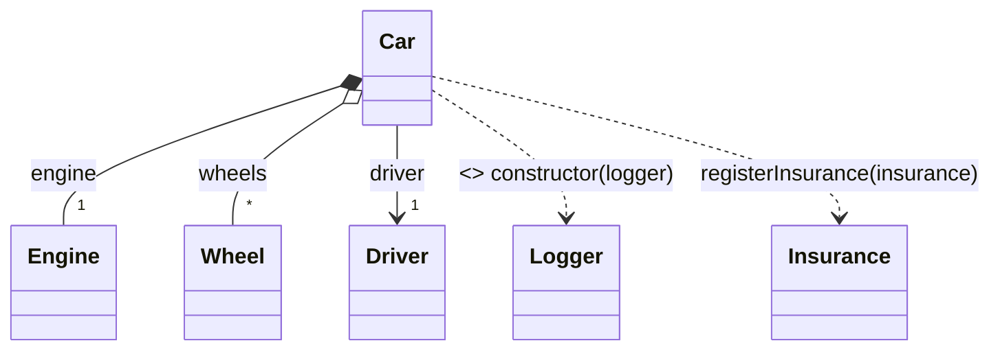

# 物件導向依賴分析系統 (OO Dependency Analysis System)

> **版本**: 1.1
> **狀態**: Phase 1 Complete ✅ | Phase 1.5 Planning 📋
> **最後更新**: 2025-11-13

---

## 專案背景 (Background)

### 問題現況

**改進前的限制**:
- ❌ 只能偵測繼承 (`extends`) 和介面實作 (`implements`)
- ❌ 無法偵測組合、聚合、依賴、關聯、依賴注入
- ❌ 依賴 AI 生成依賴圖表（昂貴、不可靠、緩慢）
- ❌ 缺乏 Import/Export 分析
- ❌ 無 AST 快取機制

### 改進目標

✅ 完整的物件導向關係分析（6 種 OO 關係）
✅ 基於 AST 的精確分析（非 AI）
✅ 支援多語言（JS/TS、Java、Python）
✅ 標準 UML 視覺化符號
✅ 正確性與完整性優先

---

## 系統架構 (System Architecture)

```
┌─────────────────────────────────────────────────────────────┐
│                     UML Service (Entry Point)               │
└──────────────────────┬──────────────────────────────────────┘
                       │
         ┌─────────────▼────────────────┐
         │   Parse Code to AST          │
         │  (@babel/parser)             │
         └─────────────┬────────────────┘
                       │
         ┌─────────────▼────────────────┐
         │   OO Analysis Service        │
         │  • extractImports()          │
         │  • extractComposition()      │
         │  • extractAggregation()      │
         │  • extractDependency()       │
         │  • extractAssociation()      │
         │  • extractInjection()        │
         │  • resolveTypeInfo()         │
         └─────────────┬────────────────┘
                       │
         ┌─────────────▼────────────────┐
         │   Generate Mermaid UML       │
         │  (◆ ◇ → ··> symbols)         │
         └──────────────────────────────┘
```

### 核心元件

**UnifiedAST Model** (`src/types/ast.ts`)
- 統一的 AST 型別定義，支援多語言
- 定義 `ImportInfo`, `DependencyInfo`, `ClassInfo`, `PropertyInfo` 等

**OOAnalysisService** (`src/services/ooAnalysisService.ts`)
- 核心分析引擎，提取 6 種 OO 關係
- 型別解析系統（處理陣列、泛型、聯合型別）

**UMLService Enhancement** (`src/services/umlService.ts`)
- 整合 OOAnalysisService
- 生成標準 UML 符號的 Mermaid 圖表

---

## OO 關係類型 (OO Relationship Types)

### 支援的 6 種關係

| 關係 | UML 符號 | 偵測規則 | Mermaid 語法 |
|------|----------|----------|--------------|
| **Inheritance** (繼承) | ◁ 實線 | `extends` | `<\|--` |
| **Realization** (實作) | ◁ 虛線 | `implements` | `<\|..` |
| **Composition** (組合) | ◆ 實心菱形 | `private` 類別屬性 | `*--` |
| **Aggregation** (聚合) | ◇ 空心菱形 | `public` 陣列屬性 | `o--` |
| **Dependency** (依賴) | → 虛線 | 方法參數/回傳值 | `..>` |
| **Association** (關聯) | → 實線 | `public` 單一物件 | `-->` |
| **Injection** (注入) | → 虛線 `<<inject>>` | 建構子參數 | `..> : <<inject>>` |

### 範例

```typescript
class Car {
  private engine: Engine;        // Composition (◆)
  public wheels: Wheel[];        // Aggregation (◇)
  public driver: Driver;         // Association (→)

  constructor(private logger: Logger) { }  // Injection

  registerInsurance(insurance: Insurance): void { }  // Dependency
}
```

**生成的 UML**:


---

## 實作進度 (Implementation Progress)

### ✅ Phase 1: JavaScript/TypeScript OO 分析（已完成）

#### 新增檔案

| 檔案 | 行數 | 說明 |
|------|------|------|
| `src/types/ast.ts` | 422 | 統一 AST 型別定義 |
| `src/services/ooAnalysisService.ts` | 687 | OO 分析引擎 |
| `src/__tests__/unit/services/ooAnalysisService.test.ts` | 636 | 22 個單元測試 |
| `test-oo-relationships.ts` | 280 | 完整測試範例 |
| `TEST-OO-ANALYSIS.md` | 388 | 測試指南 |

#### 修改檔案

- `src/services/umlService.ts` - 整合 OOAnalysisService，重構型別解析
- `src/services/umlService.test.ts` - 更新測試

#### 實作功能

✅ Import/Export 分析（ES6, 動態 import, CommonJS）
✅ 6 種 OO 關係偵測
✅ 型別解析系統（陣列、泛型、聯合型別、類別型別識別）
✅ Mermaid UML 生成（標準符號、基數標記）

---

## 測試結果 (Test Results)

### 單元測試覆蓋率

- **OOAnalysisService**: 95.27% (22 tests passed)
- **UMLService**: 87.85%
- **整體**: 332 tests passed

### 測試案例輸出範例

```
📦 IMPORT 分析: 2 modules
🔗 OO 關係分析:
  💎 Composition:   1 relationship
  ◇ Aggregation:    1 relationship
  → Association:    1 relationship
  ··> Dependency:   3 relationships
  💉 Injection:     1 relationship

📊 統計:
  Classes: 7 | Imports: 2 | Exports: 6 | Total Relationships: 8
```

---

## 已解決的問題 (Resolved Issues)

### 🐛 Issue #1: Empty Diagram Parse Error

**問題**: 無類別時生成空 `classDiagram` 導致 Mermaid 解析錯誤
**解決**: 加入佔位符類別 `NoClassesFound`

### 🐛 Issue #2: Array Type Parsing Bug (Critical)

**問題**: `Wheel[]` 被解析為 `Array`，導致錯誤的關係類型
**原因**: 遞迴型別解析遺失陣列元素資訊
**解決**: 重構為 `getTSTypeString()` 方法，正確處理 `TSArrayType`

**修正前**: `{ type: "Array", isArray: false }` → Association (錯誤)
**修正後**: `{ type: "Wheel[]", isArray: true }` → Aggregation (正確)

### 🐛 Issue #3: Built-in Type Classification

**問題**: `Array`, `Map`, `Set` 被誤判為類別型別
**解決**: 排除內建型別清單 (`Array`, `Map`, `Set`, `Promise`, `Date`, etc.)

---

## 未來工作 (Future Work)

### 🚀 Phase 1.5: 跨檔案雙向依賴分析 (Cross-File Bidirectional Analysis)

**目標**: 支援正向、反向、雙向追蹤，提供完整的依賴關係視圖

**重要性**: ⭐⭐⭐⭐⭐ **CRITICAL - 重構與影響評估的必要功能**

**時程**: 2-3 週 | **測試覆蓋率**: ≥90%

---

#### 問題現況

**單向追蹤的限制**:

```typescript
// models/Engine.ts
export class Engine { }

// models/Car.ts
import { Engine } from './Engine';
export class Car {
  private engine: Engine;
}

// models/Truck.ts
import { Engine } from './Engine';
export class Truck {
  private engine: Engine;  // ⚠️ 從 Car.ts 分析時看不到 Truck
}

// models/Bus.ts
import { Engine } from './Engine';
export class Bus {
  private engine: Engine;  // ⚠️ 從 Car.ts 分析時看不到 Bus
}
```

**從 Car.ts 分析** → 只看到 `Car`, `Engine`（遺漏 `Truck`, `Bus`）
**從 Engine.ts 分析** → 只看到 `Engine`（看不到誰在用它）

---

#### 解決方案：三種分析模式

| 模式 | 說明 | 使用情境 | 需要掃描專案 |
|------|------|----------|--------------|
| **Forward** (正向) | 追蹤當前檔案依賴的類別 | 理解類別的依賴關係 | ❌ No |
| **Reverse** (反向) | 找出誰依賴當前檔案 | 重構前影響評估 | ✅ Yes |
| **Bidirectional** (雙向) | 結合正向 + 反向 | 完整的依賴網路 | ✅ Yes |

---

#### 架構設計

```
┌─────────────────────────────────────────────────────┐
│  UMLService.generateCrossFileClassDiagram()         │
│                                                      │
│  ┌────────────────────────────────────────────┐    │
│  │ Mode Selection                             │    │
│  │                                             │    │
│  │  [Forward]  → CrossFileAnalysisService     │    │
│  │                • resolveImports()          │    │
│  │                • depth 1-3                 │    │
│  │                                             │    │
│  │  [Reverse]  → ProjectScanner               │    │
│  │                • scanProjectFiles()        │    │
│  │                • findReverseDependencies() │    │
│  │                • depth 1-3                 │    │
│  │                                             │    │
│  │  [Bidirectional] → Forward + Reverse       │    │
│  │                  • merge results           │    │
│  │                  • deduplicate classes     │    │
│  └────────────────────────────────────────────┘    │
│                                                      │
│  └─→ Merge all classes & generate Mermaid          │
└─────────────────────────────────────────────────────┘
```

---

#### 核心元件

**1. CrossFileAnalysisService (Forward Mode)**
```typescript
resolveImports(filePath, imports, projectPath, maxDepth)
  → Map<moduleName, { classes, imports, filePath, depth }>
```

**功能**:
- 遞迴追蹤 import 依賴
- 解析相對路徑 (`./`, `../`)、TS path aliases (`@/models`)
- 避免循環依賴、可設定深度限制

**2. ProjectScanner (Reverse Mode)** - **新增**
```typescript
findReverseDependencies(targetFile, projectPath, maxDepth)
  → Array<{ filePath, classes, dependencyType }>
```

**功能**:
- 掃描專案所有檔案（使用 ignore patterns）
- 解析每個檔案的 import 語句
- 過濾出引用 targetFile 的檔案
- 提取這些檔案的類別定義
- 支援深度控制（depth 1 = 直接依賴者，depth 2 = 間接依賴者）

**3. BidirectionalAnalyzer** - **新增**
```typescript
analyze(filePath, projectPath, options)
  → {
      forwardDeps: ClassInfo[],   // 當前檔案依賴誰
      reverseDeps: ClassInfo[],   // 誰依賴當前檔案
      allClasses: ClassInfo[],    // 合併去重
      relationships: DependencyInfo[]
    }
```

---

#### API 設計

**新增參數**:

```typescript
POST /api/uml/generate
{
  crossFileAnalysis: boolean,
  analysisMode: 'forward' | 'reverse' | 'bidirectional',  // ⬅️ 新增
  analysisDepth: 1-3,
  includeExternalTypes: boolean
}
```

**使用範例**:

**Forward Mode** (預設):
```json
{
  "filePath": "/project/models/Car.ts",
  "analysisMode": "forward",
  "analysisDepth": 1
}
// 結果: Car → Engine, Wheel, Driver
```

**Reverse Mode**:
```json
{
  "filePath": "/project/models/Engine.ts",
  "analysisMode": "reverse",
  "analysisDepth": 1
}
// 結果: Engine ← Car, Truck, Bus
```

**Bidirectional Mode**:
```json
{
  "filePath": "/project/models/Engine.ts",
  "analysisMode": "bidirectional",
  "analysisDepth": 1
}
// 結果:
//   Forward: Engine → (無依賴)
//   Reverse: Engine ← Car, Truck, Bus
//   合併: Engine, Car, Truck, Bus (完整視圖)
```

---

#### 實作細節

**Reverse Mode 實作流程**:

```typescript
class ProjectScanner {
  async findReverseDependencies(
    targetFile: string,
    projectPath: string,
    maxDepth: number
  ): Promise<ReverseDependencyResult> {
    const results: FileInfo[] = [];
    const visited = new Set<string>();

    // 1. 掃描專案所有原始檔
    const allFiles = await this.scanProjectFiles(projectPath, {
      extensions: ['.ts', '.tsx', '.js', '.jsx'],
      ignorePatterns: ['node_modules', 'dist', '.git']
    });

    // 2. 找出直接依賴 targetFile 的檔案
    const directDependents = await this.findDirectDependents(
      targetFile,
      allFiles
    );

    // 3. 如果 depth > 1，遞迴找出間接依賴者
    if (maxDepth > 1) {
      for (const dep of directDependents) {
        const indirectDeps = await this.findReverseDependencies(
          dep.filePath,
          projectPath,
          maxDepth - 1
        );
        results.push(...indirectDeps);
      }
    }

    return { dependents: results, depth: maxDepth };
  }

  private async findDirectDependents(
    targetFile: string,
    candidateFiles: string[]
  ): Promise<FileInfo[]> {
    const dependents: FileInfo[] = [];

    for (const file of candidateFiles) {
      const code = await fs.readFile(file, 'utf-8');
      const ast = parse(code);
      const imports = this.extractImports(ast);

      // 檢查是否 import targetFile
      for (const imp of imports) {
        const resolvedPath = this.resolveImportPath(file, imp.source);
        if (resolvedPath === targetFile) {
          const classes = this.extractClasses(ast);
          dependents.push({ filePath: file, classes, imports });
          break;
        }
      }
    }

    return dependents;
  }
}
```

---

#### 效能評估

**Forward Mode**:

| 深度 | 檔案數 | 預估時間 | 優化 |
|------|--------|----------|------|
| 1 | 1-10 | ~100-500ms | 平行解析 |
| 2 | 10-50 | ~500ms-2s | AST 快取 |
| 3 | 50-200 | ~2-5s | 限制預設值 |

**Reverse Mode**:

| 專案規模 | 檔案數 | 掃描時間 | 優化 |
|----------|--------|----------|------|
| 小型 | 50-200 | ~500ms-1s | 快取 import map |
| 中型 | 200-1000 | ~2-5s | 增量掃描 |
| 大型 | 1000+ | ~5-10s | 背景索引 |

**Bidirectional Mode**: Forward + Reverse 時間總和

---

#### 優化策略

1. **Import Map 快取** - Phase 3
   - 建立專案級 import 索引
   - `Map<filePath, Array<importedFiles>>`
   - 檔案修改時增量更新

2. **平行掃描**
   - 使用 `Promise.all()` 平行解析多個檔案
   - Worker threads for 大型專案

3. **智慧過濾**
   - 預設排除 `node_modules`, `dist`, `test`
   - 使用者可自訂 ignore patterns

4. **深度限制**
   - Forward mode: 預設 depth=1
   - Reverse mode: 預設 depth=1（避免掃描過多）
   - Bidirectional mode: 預設 depth=1

---

#### UI 設計

**Web UI 控制項**:

```vue
<v-select v-model="analysisMode" label="Analysis Mode">
  <v-option value="forward">Forward (追蹤依賴)</v-option>
  <v-option value="reverse">Reverse (影響分析)</v-option>
  <v-option value="bidirectional">Bidirectional (完整視圖)</v-option>
</v-select>

<v-slider
  v-model="analysisDepth"
  :min="1" :max="3"
  :label="`Depth: ${analysisDepth}`"
/>

<v-alert v-if="analysisMode !== 'forward'" type="info">
  Reverse/Bidirectional mode will scan project files (may be slower)
</v-alert>
```

---

### 🚀 Phase 2: 多語言支援 (Multi-Language Support)

**目標**: 擴展支援 Java 和 Python

**時程**: 2-3 週

#### 核心設計

**Parser Registry**
```typescript
class ParserRegistry {
  register('js', new JavaScriptParser());
  register('ts', new TypeScriptParser());
  register('java', new JavaParser());      // 使用 java-parser
  register('py', new PythonParser());      // 使用 tree-sitter-python
}
```

**Java 特殊處理**: Annotations (`@Autowired`), Inner classes, Generic types
**Python 特殊處理**: Type hints, Decorators, Multiple inheritance, Duck typing

---

### 🚀 Phase 3: AST 快取服務 (AST Cache Service)

**目標**: 快取已解析的 AST，避免重複解析

**前置需求**: Phase 1.5 跨檔案分析

**時程**: 1 週

#### 快取策略

- 基於檔案修改時間 (`mtimeMs`)
- LRU eviction（記憶體限制）
- 手動清除 (API endpoint)

**預期效能提升**:
- 首次分析: ~50-200ms（不變）
- 重複分析: ~5-20ms（快 10-20 倍）

---

### 🚀 Phase 4: 專案級依賴分析 (Project-Level Analysis)

**目標**: 分析整個專案的依賴關係

**時程**: 2-3 週

#### 核心功能

- 專案掃描（所有原始檔）
- 建立專案級依賴圖 (`DependencyGraph`)
- 計算依賴度量（inDegree, outDegree, complexity）
- 偵測循環依賴
- 專案級 UML 視覺化

---

### 🚀 Phase 5: 進階功能 (Advanced Features)

**目標**: 程式碼品質分析與設計模式識別

**時程**: 4-6 週

#### 功能列表

- 循環依賴偵測 (DFS 演算法)
- 死碼偵測 (未引用類別)
- 設計模式識別 (Singleton, Factory, Observer, Strategy, etc.)
- 程式碼度量 (Cohesion, Coupling, Complexity)

---

## 結論 (Conclusion)

### Phase 1 成果

✅ 完整的 6 種 OO 關係偵測
✅ 95%+ 測試覆蓋率
✅ 標準 UML 符號支援
✅ 精確的型別解析
✅ Import/Export 分析

### 未來 Roadmap

1. **Phase 1.5**: 跨檔案分析 ⭐ **優先實作**
2. **Phase 2**: 多語言支援 (Java, Python)
3. **Phase 3**: AST 快取服務
4. **Phase 4**: 專案級依賴分析
5. **Phase 5**: 進階功能（循環依賴、死碼偵測、設計模式識別）

---

**文件版本**: 1.1
**作者**: Claude Code (AI Assistant)
**最後更新**: 2025-11-13
**狀態**: Phase 1 Complete ✅ | Phase 1.5 Planning 📋
